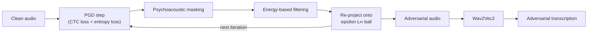
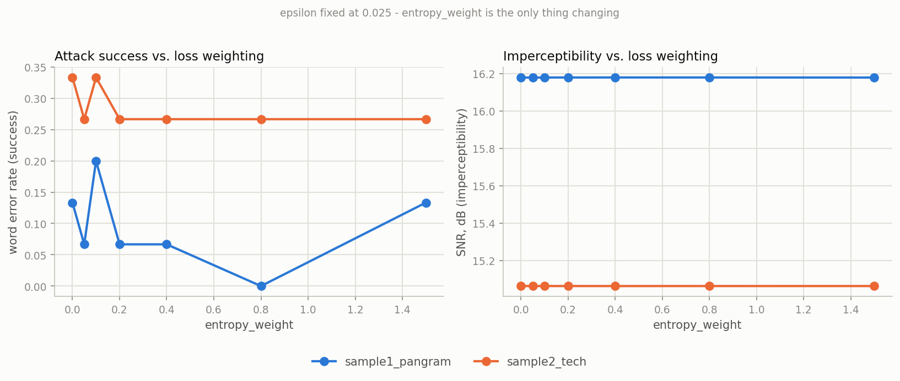
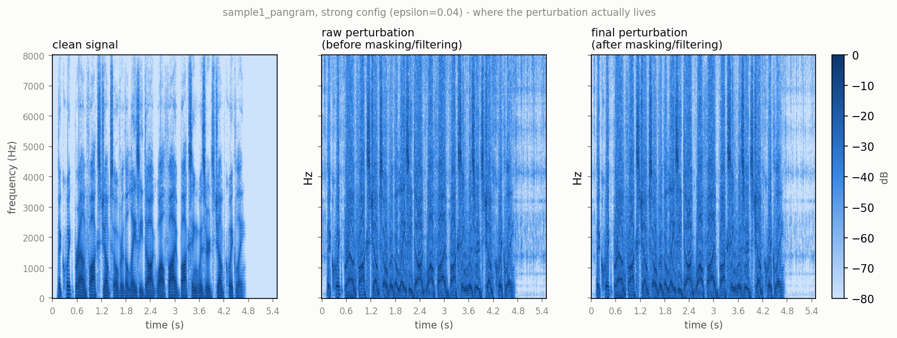

# Adversarial Attack on Wav2Vec2

## 📌 Description
This demonstrates an adversarial attack against the Wav2Vec2 ASR model.
By adding small, imperceptible perturbations to an audio signal, we can manipulate the model's transcription while keeping the modifications inaudible to humans.

## ⚡ Methods Implemented
- **Projected Gradient Descent (PGD)** attack on CTC loss
- **Psychoacoustic Masking** to hide perturbations
- **Energy-Based Filtering** to make the attack more discreet

## 🔄 Pipeline

Masking and filtering happen *inside* the loop, then get re-projected back onto the epsilon ball -
see Results below for what that re-projection turns out to be doing most of the work.

## 🚀 Usage
From the repository root, with dependencies installed (see the [top-level README](../README.md)):
```bash
cd audio
jupyter notebook
```
Open `attack_wav2vec2.ipynb` and run the cells top to bottom. It downloads `facebook/wav2vec2-large-960h`
(~1.2GB, cached after the first run) and attacks the two sample clips under `samples/`.

## 📊 Results
Two short, license-free sample clips (synthetic text-to-speech audio, not a copyrighted recording or
anyone's voice) were run through the attack at two perturbation budgets each:

| sample | config | epsilon | WER | L∞ | L2 | SNR (dB) |
|---|---|---|---|---|---|---|
| sample1_pangram | mild | 0.015 | 0.000 | 0.0150 | 3.286 | 19.9 |
| sample1_pangram | strong | 0.04 | 0.200 | 0.0400 | 7.291 | 13.0 |
| sample2_tech | mild | 0.015 | 0.400 | 0.0150 | 3.831 | 18.9 |
| sample2_tech | strong | 0.04 | 0.400 | 0.0400 | 8.641 | 11.8 |

`WER` is the word error rate between the original and adversarial transcription (there's no external
ground-truth transcript, so this measures how much the attack degrades the model's own baseline reading
of each clip). `L∞`/`L2` are the perturbation size in the normalized `[-1, 1]` waveform, kept within the
stated `epsilon` budget by re-projecting after psychoacoustic masking and energy filtering are applied.
`SNR` is signal power over perturbation power, a rough proxy for how audible the perturbation is likely
to be.

Raw and adversarial `.wav` files for every sample/config pair are committed under `samples/` — open them
directly on GitHub to listen, or see `samples/results.json` for the full metrics.

### The actual trick: tuning the loss, not just running PGD
The attack's loss is `alignment_loss + entropy_weight * entropy_loss` — CTC alignment loss plus a
weighted entropy term. It's tempting to assume `entropy_weight` is a simple dial: turn it up, get a
more successful attack at the same perceptibility cost, since `epsilon` alone should bound how audible
the perturbation can be. The notebook tests that directly instead of asserting it — fixing
`epsilon=0.025` and sweeping `entropy_weight` across seven values, on both samples:



**Imperceptibility (right) is flat**, exactly as the epsilon re-projection should make it — SNR barely
moves regardless of the loss weighting. **Attack success (left) is not a dial**: `sample1_pangram`
peaks at `entropy_weight=0.1`, drops to zero at `0.8`, then partially recovers at `1.5`; plain CTC loss
alone (`entropy_weight=0.0`) is competitive with every weighted variant tested, and the best setting
differs per sample. Sign-based PGD (`torch.sign(grad)`) turns a smooth-looking weighted loss into a
step function, so a small change in the weighting can flip which samples get perturbed each iteration
rather than smoothly scaling the result. This is the real content of "the trick is the loss, and how
much you touch it up": the epsilon budget behaves predictably, but getting a specific clip to break
needs the loss weighting searched per input, not set once from theory. Full sweep in the notebook.

### Where the perturbation actually lives
A related question the method names don't answer on their own: does psychoacoustic masking + energy
filtering visibly reshape the perturbation's spectral content, compared to the raw PGD step before
they're applied?



The three panels look almost the same, and the numbers confirm it isn't just a rendering issue: raw
and final perturbation are **99.97% correlated**, with masking+filtering shifting things by only
`Linf=0.0086` (about a fifth of the `epsilon=0.04` budget) on top of an already epsilon-saturating raw
step. In this configuration, **the L∞ epsilon clamp is doing almost all of the imperceptibility work**
- masking and filtering are a real but second-order refinement, not the dominant mechanism their names
imply.

## 📖 References
- **Wav2Vec2 Paper** - [https://arxiv.org/abs/2006.11477](https://arxiv.org/abs/2006.11477)
- **Adversarial Attacks on ASR** - [https://arxiv.org/abs/1801.01944](https://arxiv.org/abs/1801.01944)
