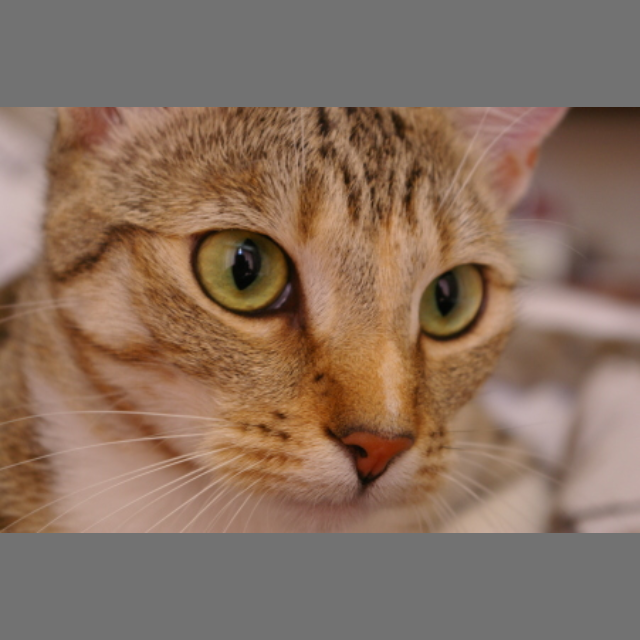

# Adversarial Attacks on Image Models

## 📌 Description
Two untargeted, L∞-bounded PGD attacks against pretrained computer vision models:
- **ResNet-18** (image classification, ImageNet) - `attack_resnet18.ipynb`
- **YOLOv8n** (object detection, COCO) - `attack_yolov8.ipynb`

Both notebooks use the same two `scikit-image` test photos (`chelsea` - a cat, `coffee` - a cup on a
table) so the attacks are reproducible without any external image downloads or licensing questions,
and both are run at two perturbation budgets: `mild` (8/255) and `strong` (16/255).

## ⚡ Methods Implemented
- **Projected Gradient Descent (PGD)**, L∞-bounded, in pixel space `[0, 1]`
- **ResNet-18**: untargeted attack on the model's own top-1 prediction (maximize cross-entropy against
  the original label, so the attack finds whatever nearby class the decision boundary is weakest against)
- **YOLOv8n**: a *disappearance attack* - suppress the confidence of every anchor the clean image
  triggers, by calling the model's raw `DetectionModel` forward pass directly (the high-level
  `predict()` API runs under `torch.inference_mode()`, which blocks gradients)

## 🚀 Usage
From the repository root, with dependencies installed (see the [top-level README](../README.md)):
```bash
cd image
jupyter notebook
```
Both notebooks download their pretrained weights on first run (ResNet-18: ~45MB via torchvision;
YOLOv8n: ~6MB via ultralytics, cached after that) and save results under `samples/`.

## 📊 Results

### ResNet-18 (classification)
All four runs flip the top-1 prediction, two of them to 100% confidence in the wrong class:

| sample | config | ε (/255) | original → adversarial | PSNR (dB) | SSIM |
|---|---|---|---|---|---|
| chelsea | mild | 8 | Egyptian cat → Persian cat | 34.0 | 0.889 |
| chelsea | strong | 16 | Egyptian cat → Persian cat | 28.2 | 0.703 |
| coffee | mild | 8 | espresso → Irish setter | 35.1 | 0.893 |
| coffee | strong | 16 | espresso → Irish setter | 29.5 | 0.727 |

<table>
<tr>
<td align="center"><b>original</b><br><br>espresso (99.0%)</td>
<td align="center"><b>adversarial, ε=16/255</b><br><br>Irish setter (100%)</td>
</tr>
</table>

### YOLOv8n (detection)
The true detection is suppressed to nothing in all four runs, but with no constraint against it, the
model also hallucinates *other* objects that were never in the image:

| sample | config | ε (/255) | before | after |
|---|---|---|---|---|
| chelsea | mild | 8 | cat (0.61) | person (0.96), donut (0.71), person (0.51), chair ×3, wine glass |
| chelsea | strong | 16 | cat (0.61) | cow (0.82) |
| coffee | mild | 8 | cup (0.91), dining table (0.46) | toilet (0.76), cat (0.49) |
| coffee | strong | 16 | cup (0.91), dining table (0.46) | cat (0.77) |

<table>
<tr>
<td align="center"><b>original</b><br><br>cat (0.61)</td>
<td align="center"><b>adversarial, ε=8/255</b><br><br>person (0.96), donut (0.71), ...</td>
</tr>
</table>

**Does explicitly penalizing hallucinations fix it?** The notebook also tries a second loss that
suppresses the top-10 most confident detections *anywhere in the image*, recomputed every iteration,
not just the ones present in the clean pass:

| sample | config | disappearance only | + explicit suppression |
|---|---|---|---|
| chelsea | mild | person, 96% | teddy bear, 39% |
| chelsea | strong | cow, 82% | vase, 62% |
| coffee | mild | toilet, 76% | *(nothing)* |
| coffee | strong | cat, 77% | cake, 45% |

It helps, roughly halving the average hallucinated confidence and eliminating it outright in one
case, but it doesn't fully solve the problem: the model still finds *some* class to push confidence
into in 3 of 4 runs. Pinning that down completely would need to suppress every anchor above some
threshold, not just the top 10, which starts to look less like an attack and more like a full
multi-objective optimization problem.

`PSNR`/`SSIM` are standard image-fidelity metrics (higher = closer to the original; 30+dB and 0.7+ SSIM
are generally considered high-fidelity), used here the same way the audio project uses SNR: as a rough
proxy for how little a human would notice.

One caveat worth being upfront about: sign-based PGD (`torch.sign(grad)`) is numerically sensitive to
the exact PyTorch/torchvision build. Every table above reflects the versions pinned in
`requirements.txt` - the labels the attack lands on can shift slightly with a different build, though
whether the true class/detection gets suppressed does not.

Raw and adversarial images for every sample/config pair are committed under `samples/resnet18/` and
`samples/yolov8n/` - open them directly on GitHub to compare, or see each folder's `results.json` for
the full metrics.

## 📖 References
- **PGD / Adversarial Training** - [Madry et al., 2017](https://arxiv.org/abs/1706.06083)
- **Adversarial Examples for Object Detection** - [Xie et al., 2017](https://arxiv.org/abs/1703.08603)
